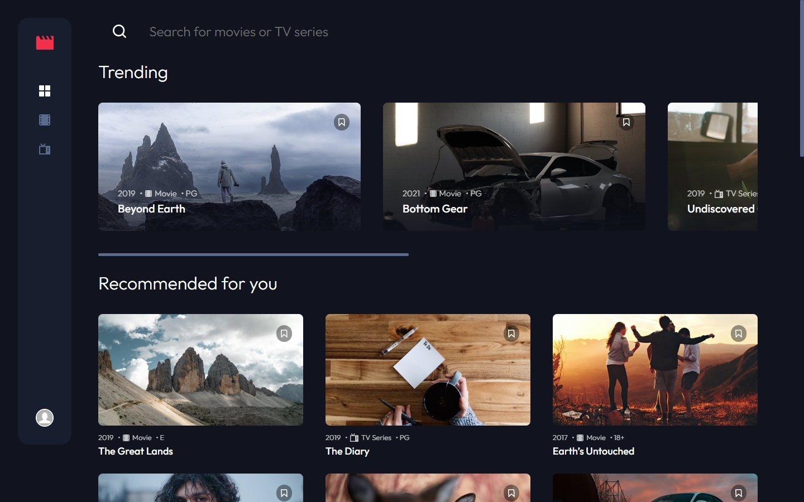
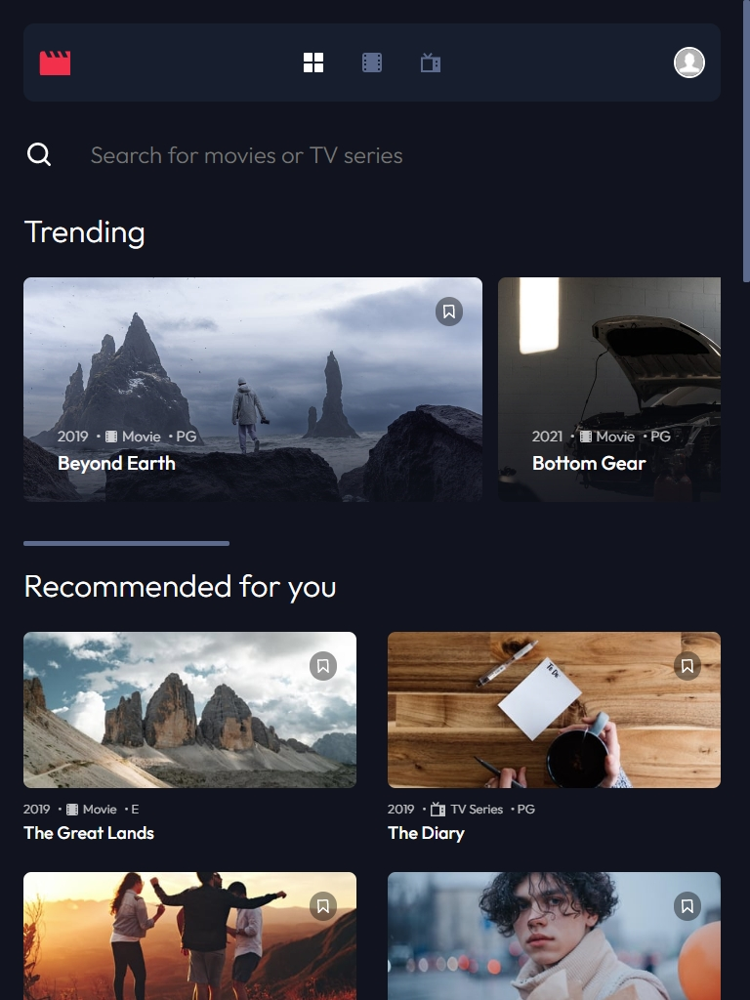
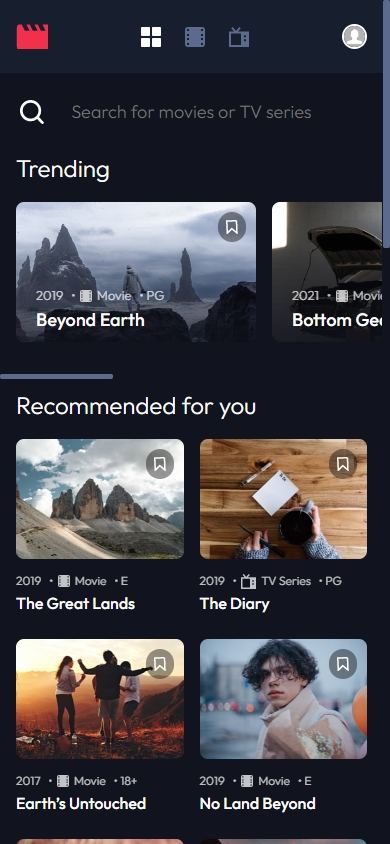

# **EntertainHub - An Entertainment Web Application**

EntertainHub is a responsive web application that enables users to discover and explore movies and TV series. With detailed information about each show, users can create an account, bookmark their favorite shows, and search for content easily. Developed using Next.js, React, and Firebase, EntertainHub provides a seamless and secure experience for users. The intuitive user interface is designed with a modern and clean look, making it accessible to users of all ages and technical abilities. Formik and Yup ensure that user input is validated, while MUI provides customizable user interface components. EntertainHub is a powerful and user-friendly platform for anyone who wants to explore and find their next favorite show to watch.

This is a solution to the [Entertainment web app](https://www.frontendmentor.io/challenges/entertainment-web-app-J-UhgAW1X). Frontend Mentor challenges help you improve your coding skills by building realistic projects.

## **Features**

- **Displaying Movies and TV Series**: EntertainHub allows users to browse and discover a wide range of movies and TV series, with detailed information on each show such as the title, synopsis, cast, and rating.

- **User Authentication using Firebase**: EntertainHub uses Firebase for user authentication, allowing users to create an account or sign in with their Google account. Firebase provides a secure and easy-to-use authentication system that integrates seamlessly with EntertainHub.

- **User Bookmarking**: EntertainHub allows users to bookmark their favorite shows so that they can easily find them again later. The bookmarking feature is implemented using Firebase's real-time database, allowing users to save and retrieve their bookmarks across different devices.

- **Show Search**: EntertainHub includes a search feature that allows users to find shows quickly and easily. The search function is implemented using React's built-in state management and MUI's input components.

- **Fully Responsive Design**: EntertainHub's user interface is designed to work seamlessly on all devices, including mobile, tablet, and desktop. The responsive design is implemented using Next.js and MUI's responsive grid system.

### Live Site URL : [Demo](https://entertain-hub-ebon.vercel.app/)

## **Screenshots**

### **Desktop:**

### **Tablet:**

### **Mobile:**

## **Technologies Used**

### **Frontend Technologies**

- Next.js Framework
- React Library
- CSS Grid and Flexbox
- Semantic HTML5

### **Backend Technologies**

- Firebase Authentication - A secure authentication service provided by Google
- Cloud Firestore - A cloud-hosted NoSQL database service provided by Google

### **Development Tools and Libraries**

- Formik - A popular library for building forms in React
- Yup - A JavaScript validation library
- Material UI - A React UI framework

## **What I Learned**

While working on EntertainHub, I gained experience in developing a responsive web application with a modern and intuitive interface. I also had the opportunity to work with several technologies and libraries that have expanded my skillset as a developer.

Some of the key takeaways from this project include:

- React hooks, such as useContext, useEffect, and useRef, which helped me to manage state, handle side effects, and access DOM elements more efficiently.
- Next.js, a framework for building server-rendered React applications, which allowed me to create a highly performant and SEO-friendly application with minimal setup and configuration.
- Firebase, a cloud-based platform that provides authentication and database services, which enabled me to build a secure and scalable backend for EntertainHub.
- Formik and Yup, two libraries that made it easy to create forms with input validation and error handling, and helped me to streamline the user input process.
- MUI, a UI library for React, which provided pre-built components and styles that enabled me to create a cohesive and visually appealing interface.

Through this project, I was able to demonstrate my proficiency in React and showcase my ability to develop a full-stack web application using various frontend and backend technologies. I also gained experience in working with Git, linting tools, and other development tools that are essential for building robust and maintainable applications.

## **Roadmap for Future Development**

Some potential features that will be added in the future include:

- Integration with a movie or TV show API, such as the Open Movie Database (OMDb) or The Movie Database (TMDb), to fetch and display data dynamically for each show.
- Implementing dynamic routing, which would allow users to access more detailed information about each movie or TV show by clicking on a link or button within the application.
- Adding more advanced search capabilities, such as filters for genre, release year, or rating, to help users find exactly what they're looking for.

## Author

- Website - [Surriya Luavan Minatchy](https://www.your-site.com)
- LinkedIn - [@Surriya Luavan Minatchy](https://www.linkedin.com/in/surriya-luavan-minatchy/)
